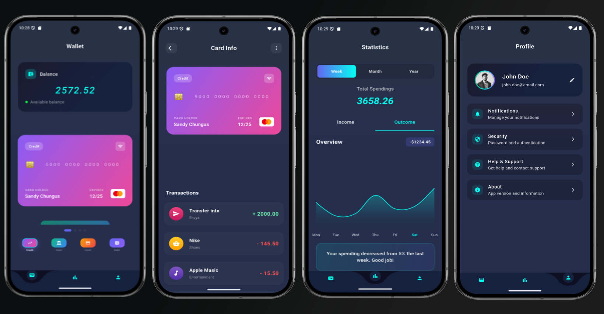

# Wallet UI Showcase

This project is a Flutter application created with the goal of improving UI design skills, focusing on modern wallet app interfaces. It features smooth animations, interactive components, and a visually appealing, contemporary design.

## Project Goals

- Practice and enhance UI/UX design in Flutter
- Implement modern wallet app concepts
- Use animations to create engaging user experiences
- Showcase best practices for layout, theming, and component structure

## Features

- Credit card visualization with flipping animation
- Transaction history and statistics
- Profile and balance overview
- Responsive and adaptive layouts

## Getting Started

To run this project:

1. Make sure you have [Flutter](https://flutter.dev/docs/get-started/install) installed.
2. Clone this repository.
3. Run `flutter pub get` to install dependencies.
4. Run `flutter run` to launch the app on your device or emulator.

## Project Layout

Below is an overview of the app's main UI structure:

